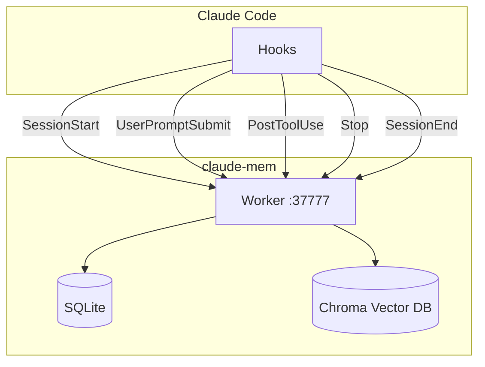

# claude-mem

Intégration de la mémoire persistante pour Claude Code.

## Vue d'ensemble

**claude-mem** est un plugin qui permet à Claude de conserver une mémoire entre les sessions.

| Propriété | Valeur |
|-----------|--------|
| Version | 7.3.3 |
| Path | `~/.claude/plugins/cache/thedotmack/claude-mem/` |
| Data | `~/.claude-mem/` |
| Port Worker | 37777 |

## Architecture



## Hooks actifs

claude-mem s'intègre via les hooks suivants :

| Hook | Fichier | Fonction |
|------|---------|----------|
| SessionStart | `context-hook.js` | Charge le contexte mémorisé |
| UserPromptSubmit | `new-hook.js` | Analyse le prompt |
| PostToolUse | `post-tool-hook.js` | Track les outils utilisés |
| Stop | `stop-hook.js` | Sauvegarde état |
| SessionEnd | `end-hook.js` | Finalise la session |

## Pas de conflit avec nos hooks

Les hooks claude-mem s'exécutent **en parallèle** de nos hooks custom :

- Notre `semantic-skill-router.py` (UserPromptSubmit) + claude-mem `new-hook.js`
- Notre `session-start-banner.py` + claude-mem `context-hook.js`

## Commandes utiles

```bash
# Rechercher dans la mémoire
mem search "terme de recherche"

# Lister les souvenirs récents
mem list

# Effacer la mémoire
mem clear
```

## Configuration

Variables d'environnement :

| Variable | Description | Défaut |
|----------|-------------|--------|
| `CLAUDE_MEM_PORT` | Port du worker | 37777 |
| `CLAUDE_MEM_DATA_DIR` | Dossier données | `~/.claude-mem/` |

## Données stockées

```
~/.claude-mem/
├── memory.db          # SQLite - métadonnées
├── chroma/            # Vector DB - embeddings
│   └── ...
└── logs/              # Logs du worker
```

## Voir aussi

- [GitHub claude-mem](https://github.com/thedotmack/claude-mem)
- [Hooks](hooks.md)
