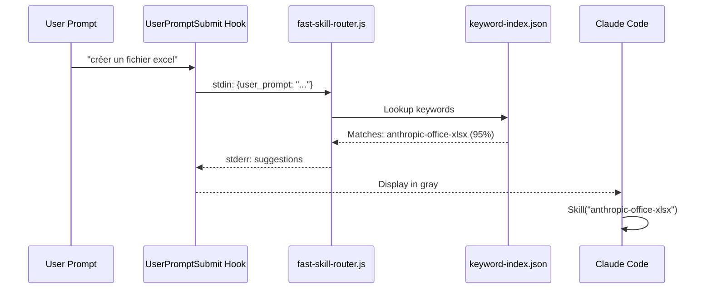

# Semantic Skill Routing

Système de suggestion automatique de skills basé sur les prompts utilisateur.

## Fonctionnement



## Architecture

### Fichiers clés

| Fichier | Rôle |
|---------|------|
| `scripts/fast-skill-router.js` | Router Node.js (~3ms) |
| `scripts/build-keyword-index.py` | Génère l'index des keywords |
| `~/.claude/cache/keyword-index.json` | Index pré-calculé |
| `registry/skill-triggers.json` | Source des triggers |

### Flux de données

```
SKILL.md (triggers YAML)
        ↓
generate-triggers.py
        ↓
skill-triggers.json
        ↓
build-keyword-index.py
        ↓
keyword-index.json (~94KB, 1300+ keywords)
        ↓
fast-skill-router.js (hook)
        ↓
Suggestions stderr (visible en gris)
```

## Configuration Hook

Dans `~/.claude/settings.json` :

```json
{
  "hooks": {
    "UserPromptSubmit": [
      {
        "hooks": [
          {
            "type": "command",
            "command": "node \"%USERPROFILE%\\.claude\\scripts\\fast-skill-router.js\"",
            "timeout": 5
          }
        ]
      }
    ]
  }
}
```

## Exemple de sortie

Quand vous tapez "créer un tableau excel avec les ventes" :

```
🎯 Skill routing (3ms):
  → anthropic-office-xlsx 95% 🌐
  → julien-ref-doc-production 45% 🌐
  💡 Invoke: Skill("anthropic-office-xlsx")
```

- `95%` = score de matching
- `🌐` = skill globale
- `📁` = skill projet

## Algorithme de scoring

### 1. Phrase exacte (poids 1.5x)

```javascript
// Si le prompt contient "créer fichier excel" exactement
if (promptLower.includes("créer fichier excel")) {
    score += weight * 1.5;
}
```

### 2. Mots individuels (poids 0.5x)

```javascript
// Pour chaque mot du prompt
for (const word of words) {
    if (keywords[word]) {
        score += weight * 0.5;
    }
}
```

### 3. Seuils

| Paramètre | Valeur |
|-----------|--------|
| `MIN_SCORE` | 0.2 |
| `TOP_K` | 3 suggestions max |

## Régénérer l'index

Après avoir modifié des triggers dans les SKILL.md :

```bash
# 1. Régénérer skill-triggers.json
python scripts/generate-triggers.py

# 2. Rebuilder l'index des keywords
python scripts/build-keyword-index.py

# L'index est automatiquement utilisé au prochain prompt
```

## Performance

| Métrique | Valeur |
|----------|--------|
| Temps de routing | ~3ms |
| Overhead subprocess | ~500ms (Windows) |
| Taille index | ~94KB |
| Keywords indexés | ~1300 |
| Skills indexées | ~55 |

**Note** : L'overhead de 500ms est dû au spawn de Node.js sur Windows. Le routing pur est <10ms.

## Debug

### Tester le router manuellement

```bash
echo '{"user_prompt": "créer un fichier excel"}' | node ~/.claude/scripts/fast-skill-router.js
```

### Vérifier l'index

```bash
python -c "
import json
from pathlib import Path
idx = json.loads((Path.home() / '.claude/cache/keyword-index.json').read_text())
print(f'Keywords: {len(idx[\"keywords\"])}')
print(f'Skills: {len(idx[\"skills\"])}')
"
```

### Logs de routing

Le router écrit sur `stderr` (visible en gris dans Claude Code). Pour capturer :

```bash
echo '{"user_prompt": "test"}' | node ~/.claude/scripts/fast-skill-router.js 2>&1
```

## Personnalisation

### Ajouter des triggers à une skill

Dans `skills/ma-skill/SKILL.md` :

```yaml
---
name: ma-skill
description: Description de ma skill
triggers:
  - phrase exacte importante
  - mot-clé
  - autre phrase
  - version française
---
```

**Bonnes pratiques** :
- Phrases complètes pour le matching exact (poids 1.5x)
- Mots uniques pour le matching partiel
- Versions FR et EN des triggers
- 5-10 triggers par skill

### Priorité projet > global

Les skills projet apparaissent avec `📁` et ont une priorité implicite plus haute dans l'affichage.
