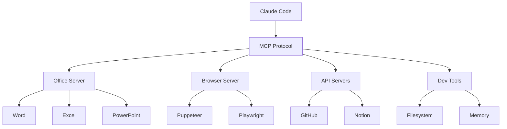

# MCP Servers

Liste des {{ mcp_count }} serveurs MCP (Model Context Protocol) configurés.

## Qu'est-ce que MCP ?

MCP (Model Context Protocol) permet à Claude d'interagir avec des outils externes : navigateurs, APIs, bases de données, etc.

## Serveurs disponibles

### Catégorie Office

| Serveur | Description | Status |
|---------|-------------|--------|
| `@anthropic/mcp-office` | Documents Office (Word, Excel, PowerPoint) | ✅ Actif |

### Catégorie Browser

| Serveur | Description | Status |
|---------|-------------|--------|
| `puppeteer` | Automatisation navigateur | ✅ Actif |
| `playwright` | Tests web automatisés | ✅ Actif |

### Catégorie API

| Serveur | Description | Status |
|---------|-------------|--------|
| `github` | API GitHub | ✅ Actif |
| `notion` | API Notion | ✅ Actif |

### Catégorie Dev Tools

| Serveur | Description | Status |
|---------|-------------|--------|
| `filesystem` | Accès fichiers | ✅ Actif |
| `memory` | Mémoire persistante | ✅ Actif |

## Architecture



## Configuration

!!! warning "Emplacement correct"
    Les serveurs MCP vont dans **`.mcp.json`**, PAS dans `settings.json` !

### Fichiers de configuration

| Fichier | Scope | Usage |
|---------|-------|-------|
| `~/.claude/.mcp.json` | 🌐 Global | MCPs disponibles partout |
| `projet/.claude/.mcp.json` | 📁 Projet | MCPs spécifiques au projet |

### Format .mcp.json

```json
{
  "nom-serveur": {
    "command": "npx",
    "args": ["-y", "@anthropic/mcp-server-nom"]
  },
  "autre-serveur": {
    "command": "python",
    "args": ["-m", "mon_module.mcp_server"]
  }
}
```

### Vérifier les MCPs actifs

```bash
# Dans Claude Code
/mcp

# Ou via CLI
claude mcp list
```

## Voir aussi

- [Guide d'installation](installer.md)
- [Documentation MCP officielle](https://modelcontextprotocol.io/)
