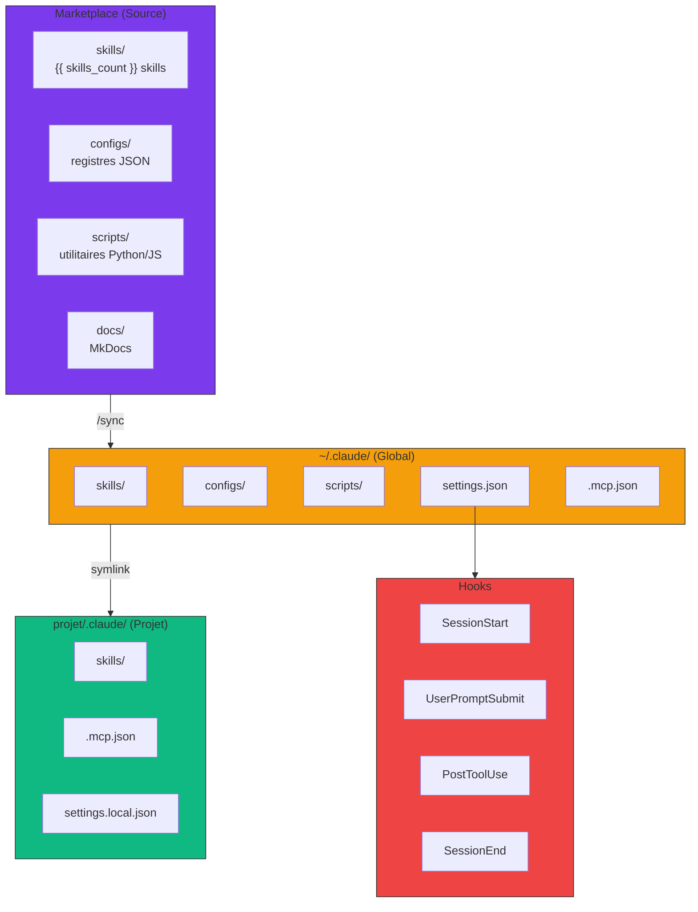
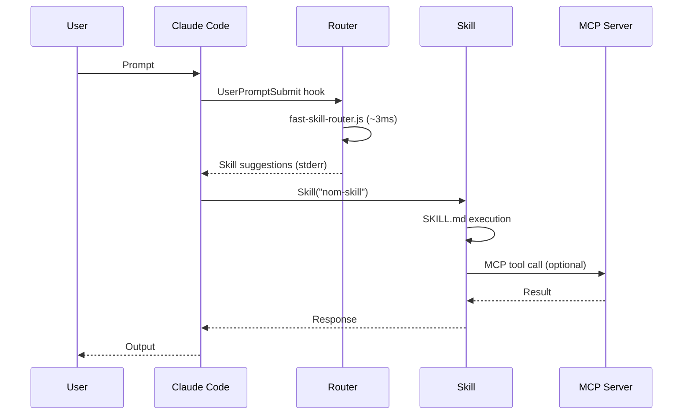

# Architecture

Vue d'ensemble de l'écosystème Claude Code Marketplace.

## Diagramme global



## Flux de données



## Composants

### 1. Marketplace (Source de vérité)

| Dossier | Contenu |
|---------|---------|
| `skills/` | {{ skills_count }} skills avec SKILL.md |
| `configs/` | Registres JSON (skills, MCPs, projets) |
| `scripts/` | Utilitaires Python/JS |
| `docs/` | Documentation MkDocs |

### 2. Global (`~/.claude/`)

Distribution globale des skills et configs :

- `skills/` - Skills synchronisées depuis marketplace
- `configs/` - Configurations (skill-triggers.json, mcp-registry.json)
- `scripts/` - Scripts pour hooks
- `cache/` - Index keyword pour routing rapide

### 3. Projet (`projet/.claude/`)

Configuration projet-spécifique :

- `skills/` - Skills locales au projet
- `.mcp.json` - Serveurs MCP du projet
- `settings.local.json` - Overrides locaux

## Priorité de résolution

```
Projet (2) > Global (1) > Marketplace (0)
```

Les skills projet ont priorité sur les globales, qui ont priorité sur celles du marketplace.

## Scripts clés

| Script | Fonction |
|--------|----------|
| `generate-triggers.py` | Extrait triggers des SKILL.md |
| `build-keyword-index.py` | Crée l'index pour routing rapide |
| `fast-skill-router.js` | Route les prompts vers skills (~3ms) |
| `discover-mcps.py` | Liste MCPs installés vs disponibles |
| `mcp-auto-install.py` | Installe MCPs depuis le registre |

## Hooks système

| Hook | Déclencheur | Script |
|------|-------------|--------|
| `SessionStart` | Démarrage Claude Code | `session-start-banner.py` |
| `UserPromptSubmit` | Chaque prompt | `fast-skill-router.js` |
| `PostToolUse` | Après Skill() | `track-skill-invocation.py` |
| `SessionEnd` | Fermeture session | `session-end-delete-reserved.py` |

## Registres JSON

### skill-triggers.json

```json
{
  "skills": [
    {
      "name": "julien-skill-creator",
      "triggers": ["créer skill", "nouvelle skill"],
      "source": "global"
    }
  ]
}
```

### mcp-registry.json

```json
{
  "mcps": {
    "playwright": {
      "category": "browser",
      "config": { "command": "cmd", "args": [...] },
      "triggers": ["playwright", "browser"]
    }
  }
}
```

### projects-registry.json

```json
{
  "projects": {
    "2025.10 Site internet Clem": {
      "path": "C:/Users/.../Clem",
      "skills": ["wp-sync-workflows", ...]
    }
  }
}
```

## Voir aussi

- [Scopes (Global vs Projet)](scopes.md) - Comprendre les 3 niveaux de configuration
- [Semantic Routing](semantic-routing.md) - Comment les skills sont suggérées automatiquement
- [Hooks](../integrations/hooks.md) - Configuration des hooks système
