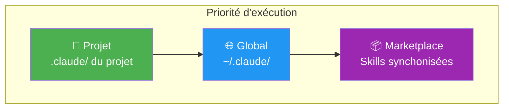

# Scopes : Global vs Projet

Comprendre les 3 niveaux de configuration de Claude Code.

## Vue d'ensemble



**Règle d'or** : Projet > Global > Marketplace

## Les 3 scopes

### 1. Scope Projet (📁)

**Emplacement** : `<projet>/.claude/`

Configuration spécifique à un projet. Priorité maximale.

```
mon-projet/
├── .claude/
│   ├── settings.json    # Settings projet
│   ├── mcp.json         # MCPs spécifiques au projet
│   └── commands/        # Commandes custom projet
│       └── mon-cmd.md
├── CLAUDE.md            # Instructions projet
└── src/
```

**Cas d'usage** :
- MCPs liés au projet (base de données, API spécifique)
- Commandes custom du projet
- CLAUDE.md avec context projet

### 2. Scope Global (🌐)

**Emplacement** : `~/.claude/` (C:\Users\julien\.claude\)

Configuration partagée entre tous les projets.

```
~/.claude/
├── settings.json        # Settings globaux
├── mcp.json             # MCPs partagés (GitHub, Notion, etc.)
├── skills/              # Skills globales
│   ├── anthropic-office-xlsx/
│   └── julien-workflow-*/
├── scripts/             # Scripts utilitaires
│   ├── fast-skill-router.js
│   └── build-keyword-index.py
├── cache/               # Caches (keyword-index.json)
├── logs/                # Logs de debug
└── commands/            # Commandes custom globales
    └── sync.md
```

**Cas d'usage** :
- Skills utilisables partout (Office, Workflow)
- MCPs génériques (Playwright, GitHub)
- Hooks globaux (semantic routing)

### 3. Scope Marketplace (📦)

**Emplacement** : Le dépôt Marketplace

Source de vérité pour les skills et configurations. Synchronisé vers Global via `/sync`.

```
Marketplace/
├── skills/              # Skills source
│   ├── anthropic-office-*/
│   ├── julien-dev-*/
│   └── julien-workflow-*/
├── configs/             # Configurations centralisées
│   ├── skill-triggers.json
│   ├── mcp-registry.json
│   └── project-skills-mapping.json
└── scripts/             # Scripts de build/sync
    └── sync-to-claude.py
```

## Résolution des conflits

### Skills

| Scope | Fichier | Priorité |
|-------|---------|----------|
| Projet | `.claude/skills/ma-skill/` | 1 (max) |
| Global | `~/.claude/skills/ma-skill/` | 2 |
| Marketplace | (sync vers global) | 3 |

Si une skill existe dans Projet et Global, la version Projet est utilisée.

### MCPs

| Scope | Fichier | Priorité |
|-------|---------|----------|
| Projet | `.claude/mcp.json` | 1 (max) |
| Global | `~/.claude/mcp.json` | 2 |

Les MCPs sont **mergés** : projet + global. En cas de conflit de nom, projet gagne.

### Settings

| Scope | Fichier | Priorité |
|-------|---------|----------|
| Projet | `.claude/settings.json` | 1 (max) |
| Global | `~/.claude/settings.json` | 2 |

Les settings sont **deep merged**. Projet override les clés spécifiques.

## Indicateurs visuels

Dans le semantic routing, les suggestions affichent le scope :

```
🎯 Skill routing (3ms):
  → anthropic-office-xlsx 95% 🌐    # Skill globale
  → mon-projet-skill 80% 📁         # Skill projet
```

Dans la liste des skills (`/check-loaded-skills`) :

```
=== Skills Projet (📁) ===
  mon-projet-skill

=== Skills Globales (🌐) ===
  anthropic-office-xlsx
  julien-workflow-advice-gemini
```

## Quand utiliser quel scope ?

### Mettre en Global (🌐)

- Skills génériques (Office, Dev Tools)
- MCPs partagés (GitHub, Playwright, Notion)
- Hooks système (semantic routing)
- Commandes utilitaires

### Mettre en Projet (📁)

- Skills spécifiques au projet
- MCPs liés au projet (DB locale, API client)
- CLAUDE.md avec contexte métier
- Commandes projet-specific

## Configuration du mapping projet

Le fichier `configs/project-skills-mapping.json` définit quelles skills sont disponibles par projet :

```json
{
  "projects": {
    "clemence-hostinger": {
      "skills": [
        "julien-clemence-*",
        "wp-*"
      ]
    },
    "streaming-app": {
      "skills": [
        "julien-media-*"
      ]
    }
  }
}
```

## Commandes utiles

```bash
# Voir les skills chargées par scope
/check-loaded-skills

# Synchroniser marketplace → global
/sync

# Lister les projets configurés
/project-list

# Info projet courant
/project-info
```

## Voir aussi

- [Architecture](architecture.md) - Vue globale du système
- [Semantic Routing](semantic-routing.md) - Comment les skills sont suggérées
- [Hooks](../integrations/hooks.md) - Configuration des hooks
