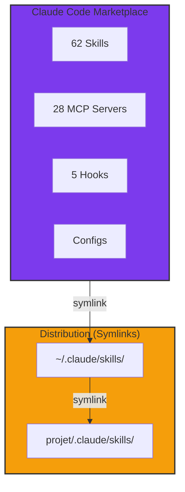

# Claude Code Marketplace

Bienvenue sur le dashboard centralisé de gestion des skills, MCP servers et hooks pour Claude Code.

## Vue d'ensemble



## Statistiques

| Catégorie | Quantité | Status |
|-----------|----------|--------|
| Skills totales | {{ skills_count }} | ✅ Actives |
| Skills à migrer | {{ pending_count }} | 🔄 En cours |
| MCP Servers | {{ mcp_count }} | ✅ Configurés |
| Projets mappés | {{ projects_count }} | ✅ Liés |

## Navigation rapide

<div class="grid cards" markdown>

- :material-puzzle: **[Skills](skills/index.md)**

    Toutes les skills disponibles avec leurs triggers

- :material-folder-multiple: **[Projets](projects/index.md)**

    Mapping skills ↔ projets

- :material-truck-delivery: **[Migration](migration/pending.md)**

    Progression de la migration des 67 skills

- :material-server: **[MCP Servers](mcp/index.md)**

    Serveurs MCP configurés

</div>

## Architecture

Le marketplace utilise une architecture **symlinks** pour la distribution :

1. **Source** : `marketplace/skills/` contient les fichiers réels
2. **Global** : `~/.claude/skills/` symlinks vers marketplace
3. **Projets** : `projet/.claude/skills/` symlinks selon le mapping

**Avantage** : Toute modification dans le marketplace est immédiatement visible partout.

## Démarrage rapide

```bash
# Synchroniser les skills
/sync

# Lancer le dashboard
mkdocs serve
```
