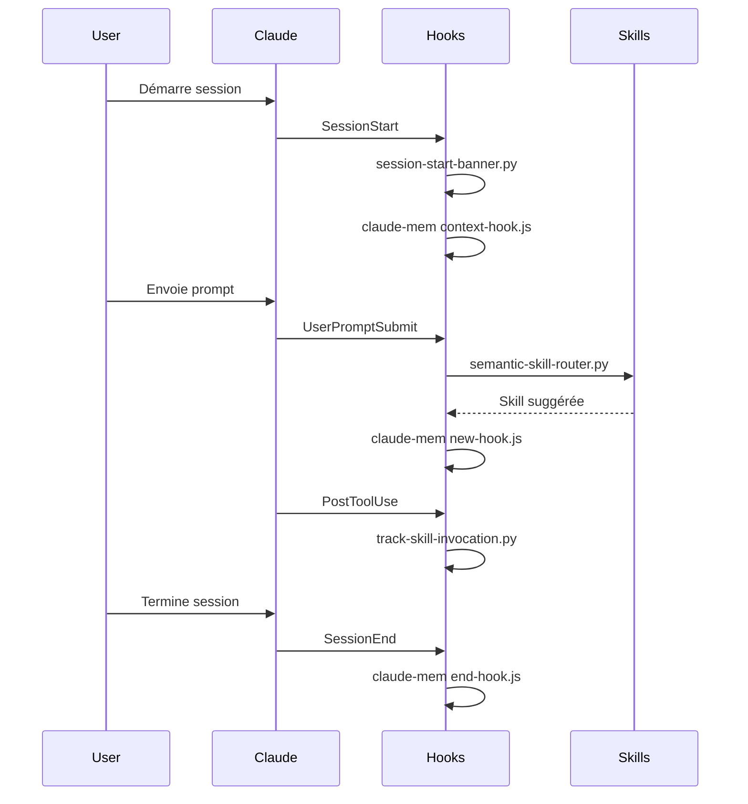

# Hooks

Configuration des hooks Claude Code dans le marketplace.

## Vue d'ensemble

Les hooks permettent d'exécuter du code à différents moments du cycle de vie d'une session Claude.

## Hooks configurés



## Nos hooks custom

### session-start-banner.py

**Event** : `SessionStart`

Affiche une bannière avec le nom du projet au démarrage.

```
========================================
[>] 2025.11 Claude Code MarketPlace
========================================
```

### semantic-skill-router.py

**Event** : `UserPromptSubmit`

Route automatiquement vers la skill appropriée basé sur le contenu du prompt.

- Utilise des embeddings HuggingFace
- Seuil de similarité : 0.4
- Compare avec tous les triggers de `skill-triggers.json`

### track-skill-invocation.py

**Event** : `PostToolUse`

Track les invocations de skills pour analytics.

## Configuration

Les hooks sont définis dans `~/.claude/settings.json` :

```json
{
  "hooks": {
    "SessionStart": [
      {
        "type": "command",
        "command": "python path/to/session-start-banner.py"
      }
    ],
    "UserPromptSubmit": [
      {
        "type": "command",
        "command": "python path/to/semantic-skill-router.py"
      }
    ]
  }
}
```

## Ordre d'exécution

Les hooks du même event s'exécutent dans l'ordre de déclaration. Les hooks de différentes sources (marketplace, claude-mem) s'exécutent tous.

## Debugging

```bash
# Logs des hooks
tail -f ~/.claude/logs/hooks.log

# Tester un hook manuellement
python scripts/semantic-skill-router.py --test "mon prompt"
```

## Voir aussi

- [claude-mem](claude-mem.md)
- [Documentation hooks Claude Code](https://docs.claude.ai/claude-code/hooks)
