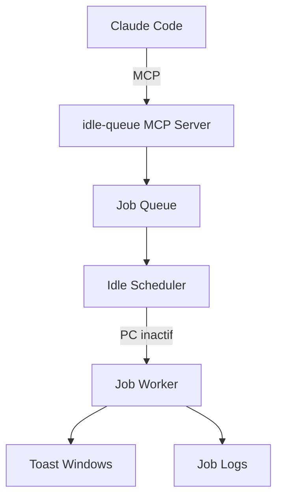

# Idle Queue (MCP Server)

Serveur MCP pour gérer une file d'attente de jobs en arrière-plan.

## Vue d'ensemble

Le serveur `idle-queue` permet à Claude de :
- Ajouter des jobs longue durée à une file d'attente
- Exécuter les jobs quand le PC est inactif
- Être notifié à la fin des jobs (toast Windows)

## Configuration

### 1. Ajouter le serveur MCP

Dans `~/.claude/.mcp.json` :

```json
{
  "idle-queue": {
    "command": "python",
    "args": ["-m", "idle_queue.mcp_server"]
  }
}
```

### 2. Ajouter le hook SessionEnd (optionnel)

Dans `~/.claude/settings.json`, ajouter dans les hooks `SessionEnd` :

```json
{
  "hooks": {
    "SessionEnd": [{
      "hooks": [{
        "type": "command",
        "command": "python -m idle_queue.hooks.check_pending_jobs",
        "timeout": 5
      }]
    }]
  }
}
```

Ce hook avertit si des jobs sont en attente avant de fermer Claude.

### 3. Redémarrer Claude Code

```bash
# Vérifier que le serveur est actif
/mcp
```

## Outils disponibles

| Outil | Description |
|-------|-------------|
| `queue_add_job` | Ajouter un job à la file |
| `queue_list_jobs` | Lister tous les jobs |
| `queue_get_status` | Status d'un job spécifique |
| `queue_get_logs` | Logs d'exécution d'un job |
| `queue_cancel` | Annuler un job en attente |
| `queue_retry` | Réessayer un job échoué |
| `queue_pause` | Mettre en pause la file |
| `queue_resume` | Reprendre l'exécution |
| `queue_system_status` | Status global du système |
| `queue_list_templates` | Lister les templates de jobs |
| `queue_run_template` | Exécuter un template |
| `queue_cleanup_events` | Nettoyer les anciens événements |

## Cas d'usage

### Transcoding vidéo

```
queue_add_job(
  name="Transcode OnePiece EP1001",
  command="ffmpeg -i input.mkv -c:v hevc output.mp4",
  priority="low"
)
```

### Batch processing

```
queue_add_job(
  name="Generate thumbnails",
  command="python scripts/generate-thumbs.py",
  depends_on=["job-id-previous"]
)
```

### Synchronisation

```
queue_add_job(
  name="Sync to Dropbox",
  command="rclone sync local: dropbox:",
  priority="background"
)
```

## Notifications

Le système utilise les **toast Windows** pour notifier :
- Quand un job démarre
- Quand un job se termine (succès/échec)
- Quand la file est vide

## Architecture



## Voir aussi

- [Installation MCP](installer.md)
- [Liste des serveurs MCP](index.md)
- [Skill queuing-background-tasks](../skills/categories/workflow.md)
