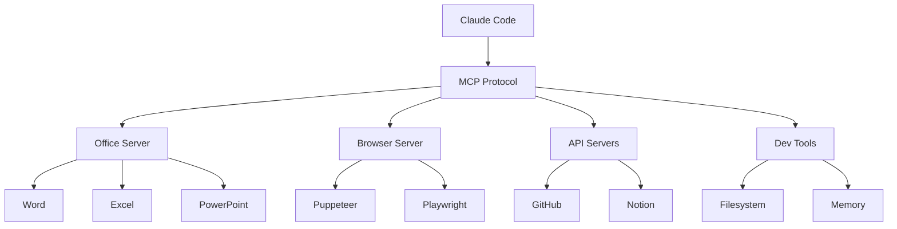

# MCP Servers

Liste des {{ mcp_count }} serveurs MCP (Model Context Protocol) configurés.

## Qu'est-ce que MCP ?

MCP (Model Context Protocol) permet à Claude d'interagir avec des outils externes : navigateurs, APIs, bases de données, etc.

## Serveurs disponibles

### Catégorie Office

| Serveur | Description | Status |
|---------|-------------|--------|
| `@anthropic/mcp-office` | Documents Office (Word, Excel, PowerPoint) | ✅ Actif |

### Catégorie Browser

| Serveur | Description | Status |
|---------|-------------|--------|
| `puppeteer` | Automatisation navigateur | ✅ Actif |
| `playwright` | Tests web automatisés | ✅ Actif |

### Catégorie API

| Serveur | Description | Status |
|---------|-------------|--------|
| `github` | API GitHub | ✅ Actif |
| `notion` | API Notion | ✅ Actif |

### Catégorie Dev Tools

| Serveur | Description | Status |
|---------|-------------|--------|
| `filesystem` | Accès fichiers | ✅ Actif |
| `memory` | Mémoire persistante | ✅ Actif |

## Architecture



## Configuration

Les serveurs MCP sont configurés dans `~/.claude/settings.json` :

```json
{
  "mcpServers": {
    "nom-serveur": {
      "command": "npx",
      "args": ["-y", "@anthropic/mcp-server-nom"]
    }
  }
}
```

## Voir aussi

- [Guide d'installation](installer.md)
- [Documentation MCP officielle](https://modelcontextprotocol.io/)
