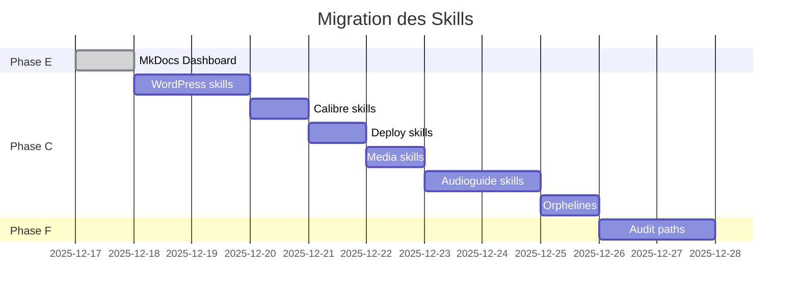

# Progression de la migration

Suivi détaillé de la migration des skills vers le marketplace centralisé.

## Dashboard

| Métrique | Valeur |
|----------|--------|
| Skills migrées | {{ migrated_count }} |
| Skills en attente | {{ total_pending }} |
| Progression | {{ progress_percent }}% |

## Timeline

## Skills migrées


| Skill | Source | Date |
|-------|--------|------|

| {{ skill.name }} | {{ skill.source }} | {{ skill.date }} |


*Aucune skill migrée pour le moment.*


## Historique

### 2025-12-17

- Création du dashboard MkDocs Material
- Configuration du plugin de génération de skills
- Mise en place de la structure documentation

## Prochaines étapes

1. **Phase C** : Migrer les 67 skills des projets
2. **Phase F** : Auditer les dépendances et chemins
3. **Phase D** : Refactorer les 28 MCP en 1 skill installer
4. **Phase A** : Implémenter le routing contextuel
