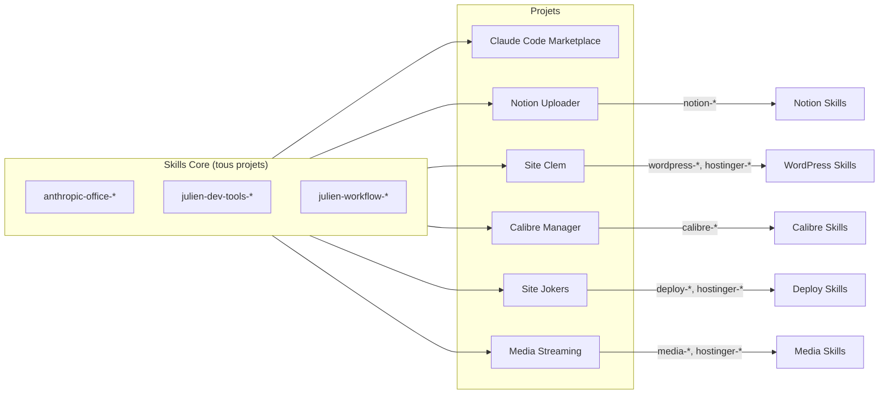

# Mapping Projets ↔ Skills

Configuration de l'attribution des skills aux différents projets.

## Architecture



## Skills Core

Ces skills sont disponibles dans **tous** les projets :

| Pattern | Description |
|---------|-------------|
| `anthropic-office-*` | Manipulation documents Office |
| `julien-dev-tools-*` | Outils de développement |
| `julien-workflow-*` | Automatisations workflow |

## Projets configurés


### {{ project.name }}

- **Identifiant** : `{{ project_id }}`
- **Tags** : {{ project.tags | join(", ") }}
- **Skills** : {{ project.skills | join(", ") }}



## Ajouter un projet

Modifier `configs/project-skills-mapping.json` :

```json
{
  "projects": {
    "owner/repo-name": {
      "name": "Nom du projet",
      "skills": ["pattern-*", "autre-skill"],
      "tags": ["tag1", "tag2"]
    }
  }
}
```

### Identifiants supportés

| Type | Format | Exemple |
|------|--------|---------|
| GitHub | `owner/repo` | `julien-music/claude-code-marketplace` |
| Chemin relatif | `~/_Projets/...` | `~/_Projets de code/2025.09 Notion Uploader` |
