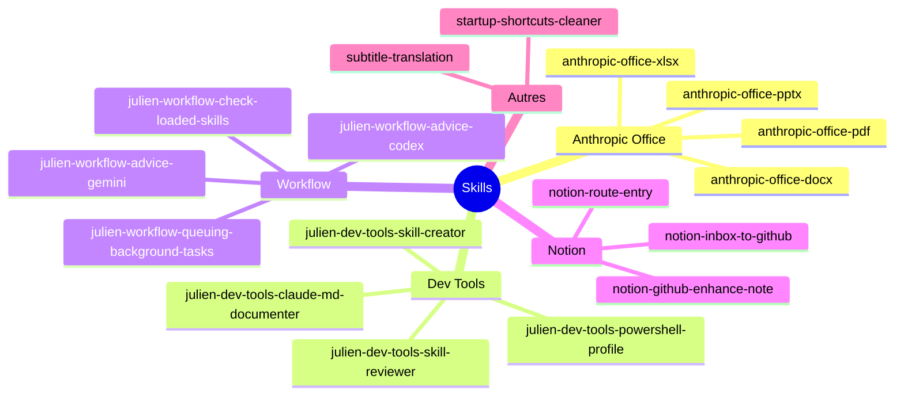

# Skills par catégorie

Vue hiérarchique des skills organisées par catégorie.

## Catégories détaillées

### Anthropic Office (4 skills)

Skills officielles Anthropic pour la manipulation de documents Office.

| Skill | Usage |
|-------|-------|
| `anthropic-office-docx` | Création/édition documents Word |
| `anthropic-office-pdf` | Manipulation PDF |
| `anthropic-office-pptx` | Présentations PowerPoint |
| `anthropic-office-xlsx` | Feuilles de calcul Excel |

### Dev Tools (4 skills)

Outils de développement et création de skills.

| Skill | Usage |
|-------|-------|
| `julien-dev-tools-claude-md-documenter` | Création CLAUDE.md |
| `julien-dev-tools-powershell-profile` | Gestion profil PowerShell |
| `julien-dev-tools-skill-creator` | Création de nouvelles skills |
| `julien-dev-tools-skill-reviewer` | Review qualité des skills |

### Workflow (4 skills)

Automatisations et workflow.

| Skill | Usage |
|-------|-------|
| `julien-workflow-advice-codex` | Avis de OpenAI Codex |
| `julien-workflow-advice-gemini` | Avis de Gemini |
| `julien-workflow-check-loaded-skills` | Vérifier skills chargées |
| `julien-workflow-queuing-background-tasks` | Queue de tâches background |

### Notion (3 skills)

Intégrations Notion.

| Skill | Usage |
|-------|-------|
| `notion-github-enhance-note` | Enrichir entrées GitHub |
| `notion-inbox-to-github` | Router inbox → GitHub DB |
| `notion-route-entry` | Router entrées inbox |

## À migrer

Les skills suivantes sont en attente de migration vers le marketplace :


### {{ source.source }}

- **Skills** : {{ source.skills | join(", ") }}
- **Quantité** : {{ source.count }}

